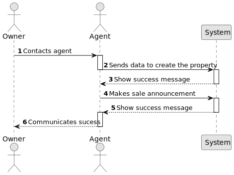

# US 002 - An agent can publish a sale

## 1. Requirements Engineering

### 1.1. User Story Description

As an agent, I can publish any sale announcement on the system, for example received through a phone call.

### 1.2. Customer Specifications and Clarifications

**From the specifications document:**

>	An employee has the role of an agent and is able to create a new property sale upon receiving information from an external channel.

**From the client clarifications:**

> **Question:**
>
> **Answer:**

### 1.3. Acceptance Criteria

* **AC1:** All required fields must be filled in.
* **AC2:** The address given for the property must be a valid one
* **AC3:** The system must verify if the property isn't already registered
* **AC4:** The property must be one of the valid property types

### 1.4. Found out Dependencies

* There is a dependency to "US003 As a system administrator, I want to register a new employee" since the platform must have at least one employee with the role of Agent to publish the property sale.
* There is a dependency to "US005  As a system administrator, I want to register a store." since you first need to have a store (agency) to be able to register agents.

### 1.5 Input and Output Data

**Input Data:**

* Typed data:
    * Address
    * Property Type (related to the property type class)
    * Owner (related to the user class)
    * Agent (related to the user class)
    * Channel of communication
    * Photos

* Selected data:
	*

**Output Data:**

* List of existing properties
* (In)Success of the operation

### 1.6. System Sequence Diagram (SSD)

**Other alternatives might exist.**

#### Alternative One

### 1.7 Other Relevant Remarks

* When a sale is published through this way, it is worth noticing that the agent that is creating it is assigned automatically to the sale.
