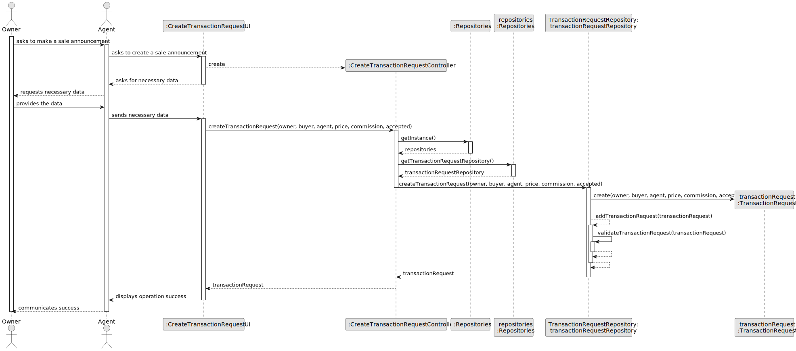
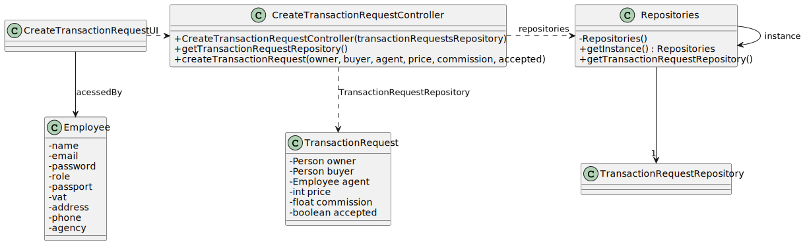

# US 002

## 3. Design - User Story Realization 

### 3.1. Rationale

**SSD - Alternative 1 is adopted.**

| Interaction ID                             | Question: Which class is responsible for...      | Answer                             | Justification (with patterns)       |
|:-------------------------------------------|:-------------------------------------------------|:-----------------------------------|:------------------------------------|
| Step 1 : Asks to create a sale annoucement | 	... interacting with the actor?                 | CreateTransactionRequestUI         | Pure Fabrication                    |
| 			  		                                    | ... coordinating the US?                         | CreateTransactionRequestController | Controller                          |
| Step 2 : Requests data  		                 | ... validating the data locally?							          | CreateTransactionRequestUI         | Pure Fabrication                    |
|                                            | ... temporarily keeping input data?              | CreateTransactionRequestUI         | Pure Fabrication                    |
| Step 3 : Submits data 		                   | ... creating the TransactionReuqest Object?      | TransactionRequestRepository       | Creator R: 1,2                      |
|                                            | ... validating the data locally?                 | TransactionRequest                 | The object created has its own data |
| Step 4 : Informs operation success         | ... informing operation success?                 | CreateTransactionRequestUI         | Pure fabrication                    |

### Systematization ##

According to the taken rationale, the conceptual classes promoted to software classes are: 

 * TransactionRequest

Other software classes (i.e. Pure Fabrication) identified: 

 * CreateTransactionRequestUI
 * CreateTransactionController

## 3.2. Sequence Diagram (SD)

### Alternative 1 - Full Diagram

This diagram shows the full sequence of interactions between the classes involved in the realization of this user story.

## 3.3. Class Diagram (CD)

