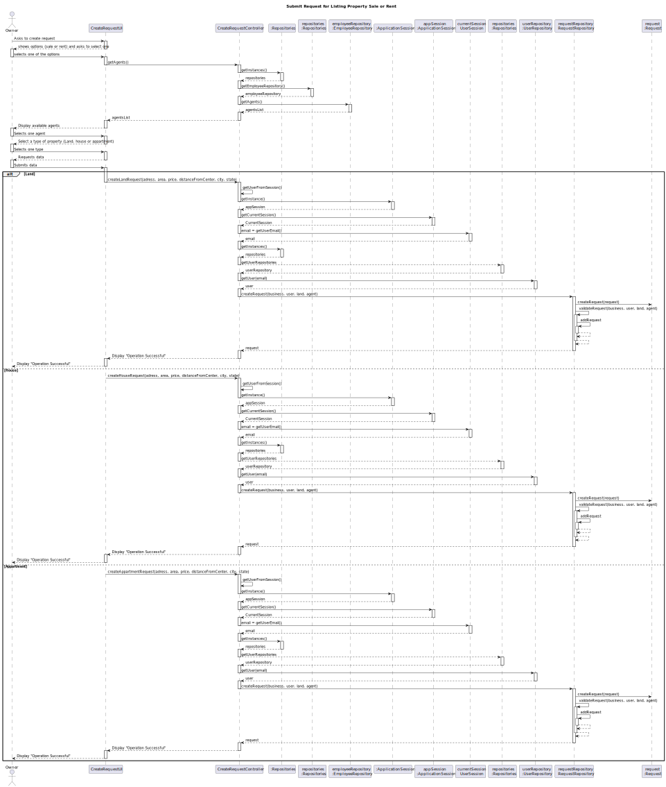
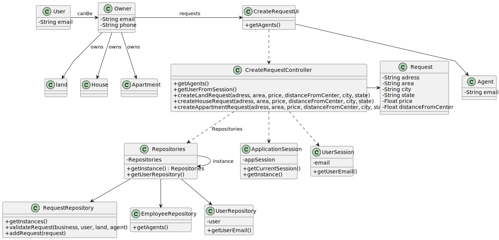

# US 004

## 3. Design - User Story Realization 

### 3.1. Rationale

**SSD - Alternative 1 is adopted.**

| Interaction ID | Question: Which class is responsible for...   | Answer                  | Justification (with patterns)                 |
|:---------------|:----------------------------------------------|:------------------------|:----------------------------------------------|
| Step 1  		     | 	... interacting with the actor?              | ControllerUI            | Pure Fabrication.                             |
| 			  		        | 	... coordinating the US?                     | CreateRequestController | Controller                                    |
| Step 2  		     | 	... creating a request                       | ControllerUI            | Pure Fabrication.                             |
| Step 3  		     | 				...validating request?			                 | RequestRepository       | RequestRepository has all the requests's info |
| Step 4  		     | 	...validating the user by email              | UserRepository          | UserRepository has all the users's info       |
| Step 5  		     | 	... adding the request                       | RequestRepository       | Creator R                                     |
| Step 6  		     | 	... informing operation success?             | CreateRequestUI         | IE: is responsible for user interactions.     | 

### Systematization ##

According to the taken rationale, the conceptual classes promoted to software classes are: 

 * Request

Other software classes (i.e. Pure Fabrication) identified: 

 * CreateRequestUI  
 * CreateRequestController

## 3.2. Sequence Diagram (SD)

### Alternative 1 - Full Diagram

This diagram shows the full sequence of interactions between the classes involved in the realization of this user story.

## 3.3. Class Diagram (CD)

