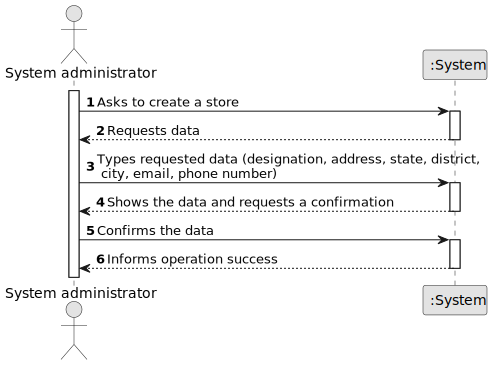

# US 005 

## 1. Requirements Engineering

### 1.1. User Story Description

As a system administrator, I want to register a store.

### 1.2. Customer Specifications and Clarifications 

**From the specifications document:**

>	The company's systems administrator will be responsible for registering branches of the network.

**From the client clarifications:**

> **Question:** Does a store designation have to be detailed? If so, will the system administrator have to register the name, email, phone number or anything else? Does the location of a store have to be detailed as well? If yes, will the system administrator have to record the address, postcode or something else? To register the store manager, does the system administrator only register the manager's name? If not, will the system administrator have to register the manager as if he were an employee (except the agent he is assigned to)?
>  
> **Answer:**  When registering a store, the System Administrator should introduce the following information: an ID, a designation/name, a location, a local manager, a phone number and an e-mail address. The ID is an integer number. An example of the store location is: 71 ST. NICHOLAS DRIVE, NORTH POLE, FAIRBANKS NORTH STAR, AK, 99705. An example phone number is (907) 488-6419.

> **Question:** Could you please share how will the designation of new stores be made, is there a pattern perhaps?
>  
> **Answer:** There is no pattern. The System Administrator can introduce any designation/name. The designation/name should have at most forty characters.

> **Question:** Will the System Administrator be able to choose a location from a list of available locations (defined elsewhere in the application) or will he be able to submit any location he wants?
> 
> **Answer:** The System Administrator can submit any location.

### 1.3. Acceptance Criteria

* **AC1:** All necessary data must be sent, so that the store can be created.
* **AC2:** If any of the data is not sent, the operation must be classified as a failure.
* **AC3:** The designation should have at most forty characters.
* **AC4:** The phone number must have 10 digits

### 1.4. Found out Dependencies

* There is a dependency to "US003" since after the store is created, it must be filled with new employees.

### 1.5 Input and Output Data

**Input Data:**

* Typed data:
	* a designation
	* a address
    * phone number
    * email

* Selected Data:
    * state
    * district
    * city

**Output Data:**

* (In)Success of the operation

### 1.6. System Sequence Diagram (SSD)

### 1.7 Other Relevant Remarks

* 