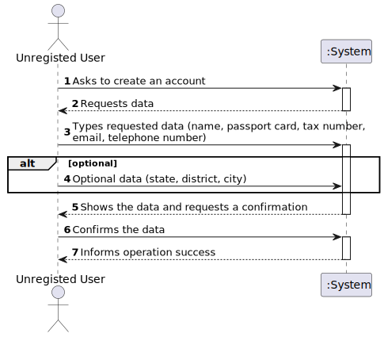

# US 007

## 1. Requirements Engineering

### 1.1. User Story Description

As an unregistered user, I want to register in the system to buy, sell or rent properties.

### 1.2. Customer Specifications and Clarifications 

**From the specifications document:**

>

**From the client clarifications:**

> **Question:** Does the user also receive the password via email or can he choose a password when registering?
>  
> **Answer:** The owner can choose a password when registering.

> **Question:** When an unregistered user wants to register a new account in the system, the set of parameters that are asked are the following: name, citizen card number, tax number, email, phone number, and password. Do you want any extra parameters/requirements to be asked or just the ones specified above? If so, which ones are mandatory?
>  
> **Answer:** The Owner attributes are: the name, the citizen's card number, the tax number, the address, the email address and the contact telephone number. The address of the owner is not mandatory.

### 1.3. Acceptance Criteria

* **AC1:** The address given for the property must be a valid one
* **AC2:** The system must verify if the user isn't already registered
* **AC3:** The address of the user is not mandatory
* **AC4:** If the data is incorret the system should be able to update the data
* **AC5:** The tax number must have 9 digits
* **AC6:** The phone number must have 10 digits

### 1.4. Found out Dependencies

* There is no dependencies.

### 1.5 Input and Output Data

**Input Data:**

* Typed data:
	* name
    * passport card number
    * tax number 
    * address
    * email
    * telephone number

* Selected data:
    * state
    * district
    * city

**Output Data:**

* (In)Success of the operation

### 1.6. System Sequence Diagram (SSD)

### 1.7 Other Relevant Remarks

*