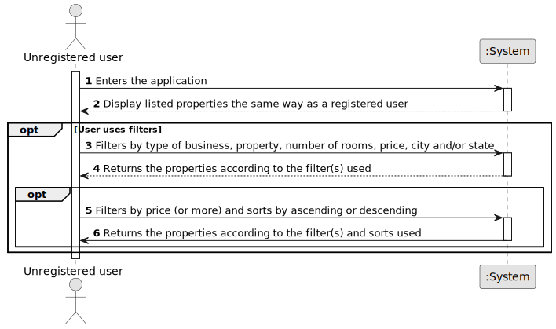

# US 001 - To create a Task 

## 1. Requirements Engineering

### 1.1. User Story Description

As an unregistered user, I want to display listed properties.

### 1.2. Customer Specifications and Clarifications 

**From the specifications document:**

Anyone that uses the application will see all the available properties of the network.

**From the client clarifications:**

> **Question:** When an unregistered user wants to list properties, the list given by the program is sorted by default with which criteria? For example the list is shown with the properties sorted by most recently added?
>  
> **Answer:** By default, the list should be shown with the properties sorted by most recently added.

> **Question:** Can an user filter the properties list for example by a type but choosing multiple values? For example the users wants to see only properties with 3 or 4 rooms.If this is possible, after filtering the list to show only the values chosen, he can sort by ascending/descending?

> **Answer:** The user should select only one value for each feature of the property. By default, the list should be shown with the properties sorted by most recently added.

### 1.3. Acceptance Criteria

* **AC1:** Must enter the application

### 1.4. Found out Dependencies

* There is a dependency to "US2" and "US4" since there must be properties listed for the user to see.
* There is a dependency to "US5" since there must be stores registered in order to list properties.

### 1.5 Input and Output Data

**Input Data:**

* Typed data:
	* None
	
**Output Data:**

* All listed properties

### 1.6. System Sequence Diagram (SSD)

### 1.7 Other Relevant Remarks