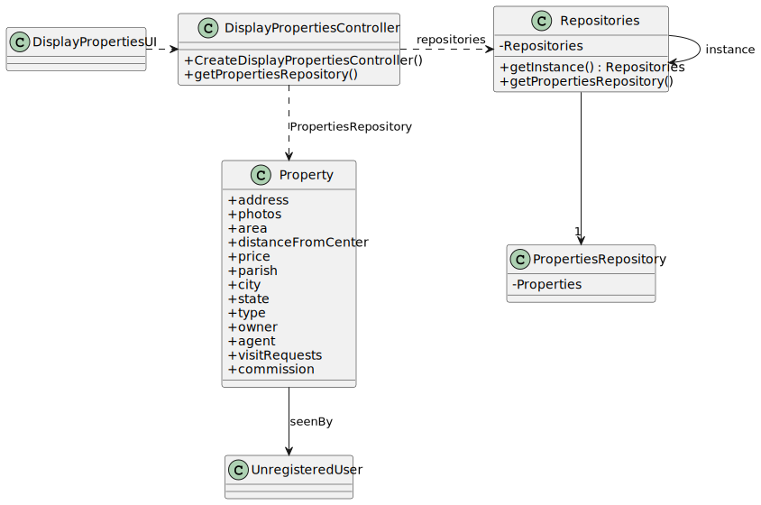

# US 001

## 3. Design - User Story Realization 

### 3.1. Rationale

**SSD - Alternative 1 is adopted.**

| Interaction ID                                | Question: Which class is responsible for... | Answer                      | Justification (with patterns)                                                                                 |
|:----------------------------------------------|:--------------------- |:----------------------------|:--------------------------------------------------------------------------------------------------------------|
| Step 1 : Asks to display listed properties 		 |	... interacting with the actor? | DisplayPropertiesUI         | Pure Fabrication: there is no reason to assign this responsibility to any existing class in the Domain Model. |
| 			  		                                       |	... coordinating the US? | DisplayPropertiesController | Controller                                                                                                    |
| Step 2 : Display listed properties   		       |							 |                             |                                                                                                               |

### Systematization ##

According to the rationale, the conceptual classes promoted to software classes are: 

 * Property

Other software classes (i.e. Pure Fabrication) identified: 

 * DisplayPropertiesUI  
 * DisplayPropertiesController

## 3.2. Sequence Diagram (SD)

### Full Diagram

This diagram shows the full sequence of interactions between the classes involved in the realization of this user story.

## 3.3. Class Diagram (CD)

