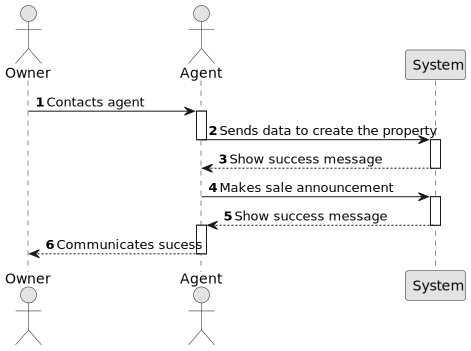

# US 002 - An agent can publish a sale

## 1. Requirements Engineering

### 1.1. User Story Description

As an agent, I can publish any sale announcement on the system, for example received through a phone call.

### 1.2. Customer Specifications and Clarifications

**From the specifications document:**

>	An employee has the role of an agent and is able to create a new property sale upon receiving information from an external channel.

**From the client clarifications:**

> **Question:**
> In USS02 are all the criteria for publishing the sale of a property in the system mandatory, or is there any data that the owner can choose not to give? such as not saying the direction of sun exposure in the case of a house.
> **Answer:**
> The number of bathrooms, the available equipment and the sun exposure are not mandatory. At least one photograph is required.

> **Question:**
> Regarding US002, the client previously stated that if the announcement is made through a phone call between the Owner and the agent, the Owner´s information wasn't needed, and therefore it wasn't recorded in the system. My question is whether this decision still applies even with the introduction of US007 (client/user registration)?
> **Answer:**
> I already clarified this point: "The agent should identify, in the system, the owner that wants to sell a property. The agent should use the owner e-mail address to identify the owner. The owner who is contacting the agent (for example, through a phone call) must be registered in the system. The agent that receives the phone call is the property responsible agent."

> **Question:**
> In US002, does the agent only register the request in the system that he receives from the owner in a phone call, or can he (the agent) also accept/reject requests that the owner registers in the system (without a phone call)?
> **Answer:**
> The agent only publishes the sale announcement that he receives from the owner in a phone call. In a previous post I also said that the agent that receives the phone call is the property responsible agent.

> **Question:**
> Is the owner able to edit an already active listing of a property? If so, do the edits need to be accepted by the agent before being published?
> **Answer:**
> No.

> **Question:**
> In one of the previous questions you have stated that for now the only way that a agent can receive the request to publish an announcement is through a phone call, however in the primary data necessary to create an announcement it's said that it's necessary to upload at least one photo of the property. Taking that into consideration, the announcement can't be fully made by only communicating with the owner through a phone call, how is it possible for an agent to publish an announcement without all the necessary data?
> **Answer:**
> The owner can send the photograph by e-mail or any other means. The owner can even deliver the photograph to the store.

> **Question:**
> Another doubt that has emerged is related to the identification of the owner of the property, isn't it required that the owner identifies themselves in the announcement ?
> **Answer:**
> Info about the owner is not published.

> **Question:**
> Is the commission an attribute of a sale or of an announcement?
> **Answer:**
> From my previous answers and from knowledge that the students obtained in the ESOFT course, each team should know the answer to this question.

> **Question:**
> When the agent receives the phone call (as mentioned in US002) is it the agent who registers the order in the system or has the order already been entered into the system by the owner? Or is the phone call just for the owner to tell the agent that he registered a request in the system?
> **Answer:**
> The agent registers the order in the system.

> **Question:**
> Is it mandatory for the agent to input the commission value before publishing an announcement?
> **Answer:**
> Yes.

> **Question:**
> Are there only 2 types of commission or can the Administrator define more types of commission?
> **Answer:**
> For now we only have two types of commissions.

> **Question:**
> When a sale order arrives at the agent, what are the acceptance criteria that he (the agent) uses to accept or reject the order? Is there a possibility for an agent to refuse due to a lack of data on the property's characteristics of a property given by the owner? Or when the request arrives at the agent, are all the essential characteristics of the property in question already present?
> **Answer:**
> Yes.

> **Question:**
> What would be the attributes of the Owner and Agent?
> **Answer:**
> The Owner attributes are: the name, the citizen's card number, the tax number, the address, the email address and the contact telephone number. The Agent is an employee of the company.

> **Question:**
> Is the phone call the only way the agent can receive the sale announcement? Or he can receive them via e-mail/letter/etc
> **Answer:**
> For now [Sprint A] this is the only way.

### 1.3. Acceptance Criteria

* **AC1:** All required fields must be filled in.
* **AC2:** The address given for the property must be a valid one
* **AC3:** The system must verify if the property isn't already registered
* **AC4:** The property must be one of the valid property types

### 1.4. Found out Dependencies

* There is a dependency to "US003 As a system administrator, I want to register a new employee" since the platform must have at least one employee with the role of Agent to publish the property sale.
* There is a dependency to "US005  As a system administrator, I want to register a store." since you first need to have a store (agency) to be able to register agents.

### 1.5 Input and Output Data

**Input Data:**

* Typed data:
    * Address
    * Property Type (related to the property type class)
    * Owner (related to the user class)
    * Agent (related to the user class)
    * Channel of communication
    * Photos

* Selected data:
	*

**Output Data:**

* List of existing properties
* (In)Success of the operation

### 1.6. System Sequence Diagram (SSD)

**Other alternatives might exist.**

#### Alternative One

### 1.7 Other Relevant Remarks

* When a sale is published through this way, it is worth noticing that the agent that is creating it is assigned automatically to the sale.
