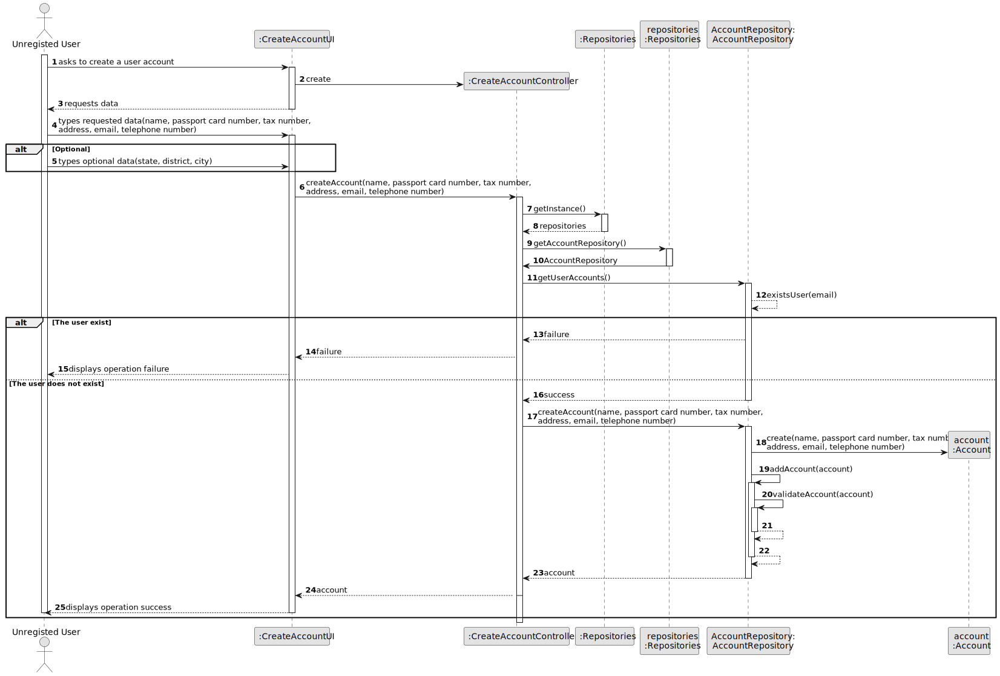
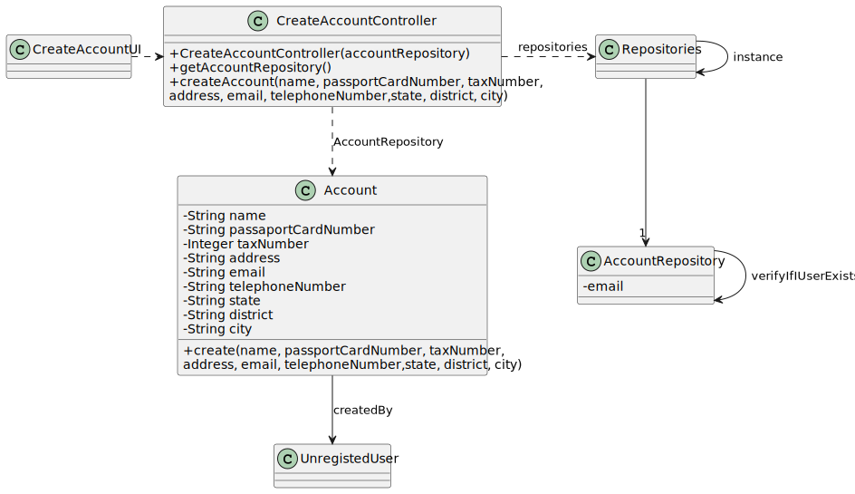

# US 007

## 3. Design - User Story Realization 

### 3.1. Rationale

**SSD - Alternative 1 is adopted.**

| Interaction ID                                      | Question: Which class is responsible for...       | Answer                  | Justification (with patterns)       |
|:----------------------------------------------------|:--------------------------------------------------|:------------------------|:------------------------------------|
| Step 1 : Asks to create an account                  | 	... interacting with the actor?                  | CreateAccountUI         | Pure Fabrication                    |
| 			  		                                             | ... coordinating the US?                          | CreateAccountController | Controller                          |
| Step 2 : Requests data  		                          | ... validating the data locally?							           | CreateAccountUI         | Pure Fabrication                    |
|                                                     | ... temporarily keeping input data?               | CreateAccountUI         | Pure Fabrication                    |
| Step 3 : Submits data 		                            | ... creating the Account Object?                  | AccountRepository       | Creator R: 1,2                      |
|                                                     | ... validating the data locally (mandatory data)? | Account                 | The object created has its own data |
| Step 5 : Shows the data and requests a confirmation |                                                   |                         |                                     |
| Step 6 : Confirms the data                          |                                                   |                         |                                     |
| Step 7 : Informs operation success                  | ... informing operation success?                  | CreateAccountUI         | Pure fabrication                    |

### Systematization ##

According to the taken rationale, the conceptual classes promoted to software classes are: 

 * Account

Other software classes (i.e. Pure Fabrication) identified: 

 * CreateAccountUI  
 * CreateAccountController

## 3.2. Sequence Diagram (SD)

### Alternative 1 - Full Diagram

This diagram shows the full sequence of interactions between the classes involved in the realization of this user story.

## 3.3. Class Diagram (CD)

