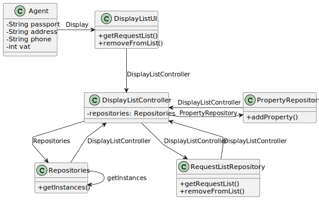

# US 004

## 3. Design - User Story Realization 

### 3.1. Rationale

**SSD - Alternative 1 is adopted.**

| Interaction ID | Question: Which class is responsible for...               | Answer                | Justification (with patterns)                            |
|:---------------|:----------------------------------------------------------|:----------------------|:---------------------------------------------------------|
| Step 1  		     | 	... interacting with the actor?                          | DisplayListUI         | Pure Fabrication.                                        |
| 			  		        | 	... coordinating the US?                                 | DisplayListController | Controller                                               |
| Step 2  		     | 	... sorts list by date                                   | RequestListRepository | IE: is responsible for providing the list sorted by date |
| Step 3  		     | 	... lists Agent's transactionRequests                    | DisplayListUI         | IE: is responsible for user interactions.                |
| Step 4  		     | 	... posts announcement                                   | PropertyRepository    | IE: is responsible for posting a new announcement        |
| Step 5  		     | 	... removes transactionRequest from repository           | RequestListRepository        | IE: is responsible for user interactions.                |
| Step 6  		     | 	... informs the agent that the opperation was successful | DisplayListUI         | IE: is responsible for user interactions.                |
### Systematization ##

According to the taken rationale, the conceptual classes promoted to software classes are: 

 * AnnouncementRequest

Other software classes (i.e. Pure Fabrication) identified: 

 * DisplayListUI  
 * DisplayListController
 * PropertyRepository
 * RequestListRepository

## 3.2. Sequence Diagram (SD)

### Alternative 1 - Full Diagram

This diagram shows the full sequence of interactions between the classes involved in the realization of this user story.

## 3.3. Class Diagram (CD)

