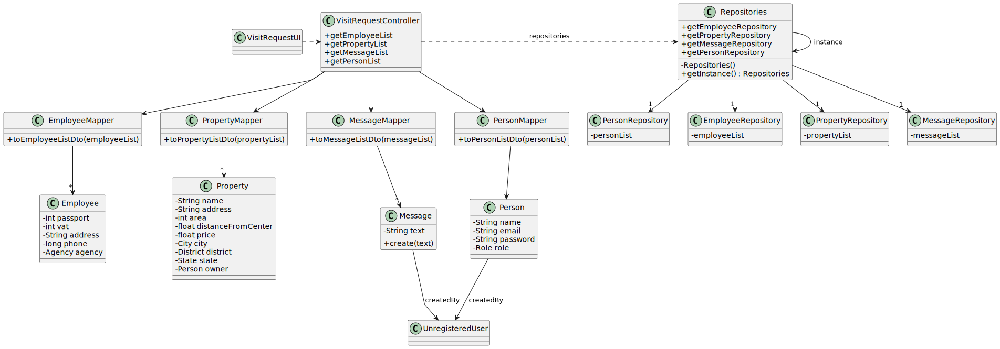

# US 009

## 3. Design - User Story Realization

### 3.1. Rationale

**SSD - Alternative 1 is adopted.**

| Interaction ID                                                               | Question: Which class is responsible for...                          | Answer                 | Justification (with patterns)                                                                                 |
|:-----------------------------------------------------------------------------|:---------------------------------------------------------------------|:-----------------------|:--------------------------------------------------------------------------------------------------------------|
| Step 1 :  Asks to make a visit request		                                     | 	... interacting with the actor?                                     | VisitRequestUI         | Pure Fabrication: there is no reason to assign this responsibility to any existing class in the Domain Model. |
| 			  		                                                                      | 	... coordinating the US?                                            | VisitRequestController | Controller                                                                                                    |
| 			  		                                                                      | 	                                                                    |                        |                                                                                                               |
| 			  		                                                                      |                                                                      |                        |                                                                                                               |
| 			  		                                                                      | 							                                                              |                        |                                                                                                               |
| 			  		                                                                      | 							                                                              |                        |                                                                                                               |
| Step 2 : types the data	                                                     | 		  					                                                            |                        |                                                            |
| Step 3 : shows the data		                                                    |                                                                      |                        |                                                                                                               |
| Step 4 : submits data		                                                      | 	      ... validating the data locally (mandatory data)?             | Message                | The object created has its own data                                                                           |
| Step 5 : checks if the data is valid and registers the request in the system | 	    ...validating all data? ... temporarily keeping input data? | VisitRequestUI         | Pure Fabrication                                                                                              |
| Step 6 : shows success message		                                             | 	... informing operation success?                                    | VisitRequestUI         | IE: is responsible for user interactions.                                                                     |  
| 	                                                                            | 							                                                              | VisitRequestUI         | Pure Fabrication                                                                                              |   
| 			  		                                                                      | ... creating the Message Object?                                     | MessageRepository      | Creator R: 1,2                                                                                                |

### Systematization ##

According to the taken rationale, the conceptual classes promoted to software classes are:

* Message
* Property

Other software classes (i.e. Pure Fabrication) identified:

* VisitRequestUI
* VisitRequestController

## 3.2. Sequence Diagram (SD)

### Alternative 1 - Full Diagram

This diagram shows the full sequence of interactions between the classes involved in the realization of this user story.

[us009-sequence-diagram-full.svg](svg/us009-sequence-diagram-full.svg)

## 3.3. Class Diagram (CD)

