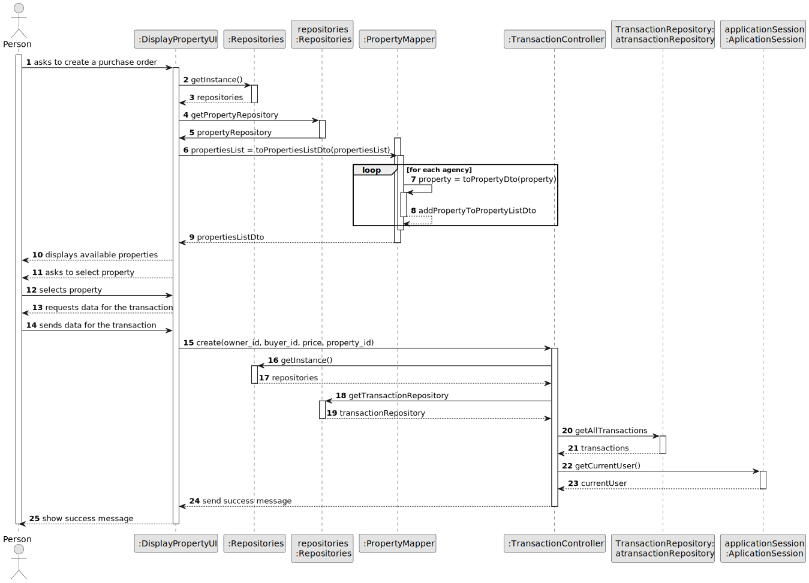
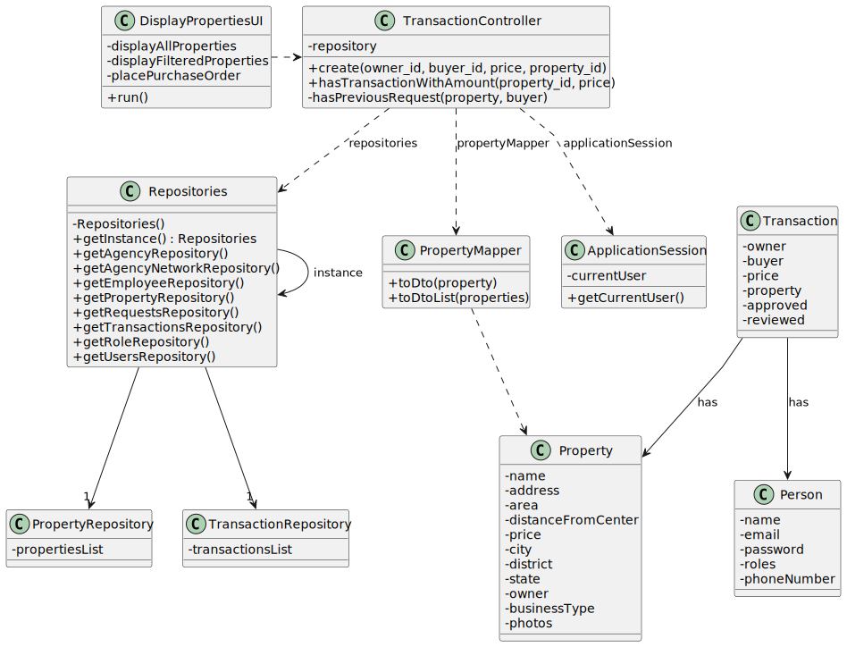

# US 010

## 3. Design - User Story Realization

### 3.1. Rationale

**SSD - Alternative 1 is adopted.**

| Interaction ID                           | Question: Which class is responsible for...  | Answer                     | Justification (with patterns)       |
|:-----------------------------------------|:---------------------------------------------|:---------------------------|:------------------------------------|
| Step 1 : Wants to place a purchase order | 	... interacting with the actor?             | DisplayPropertiesUI        | Pure Fabrication                    |
| 			  		                         | ... coordinating the US?                     | SaleAnnouncementController | Controller                          |
| Step 2 : Requests data  		               | ... validating the data locally?				         | DisplayPropertiesUI        | Pure Fabrication                    |
|                                          | ... temporarily keeping input data?          | DisplayPropertiesUI        | Pure Fabrication                    |
| Step 3 : Submits data 		                 | ... creating the Transaction (order) Object? | TransactionRepository      | Creator R: 1,2                      |
|                                          | ... validating the data locally?             | Transaction                | The object created has its own data |
| Step 4 : Informs operation success       | ... informing operation success?             | DisplayPropertiesUI        | Pure fabrication                    |

### Systematization ##

According to the taken rationale, the conceptual classes promoted to software classes are:

 * Transaction
 * Person
 * Property

Other software classes (i.e. Pure Fabrication) identified:
 * DisplayPropertiesUI
 * TransactionController

## 3.2. Sequence Diagram (SD)

### Alternative 1 - Full Diagram

This diagram shows the full sequence of interactions between the classes involved in the realization of this user story.

## 3.3. Class Diagram (CD)

