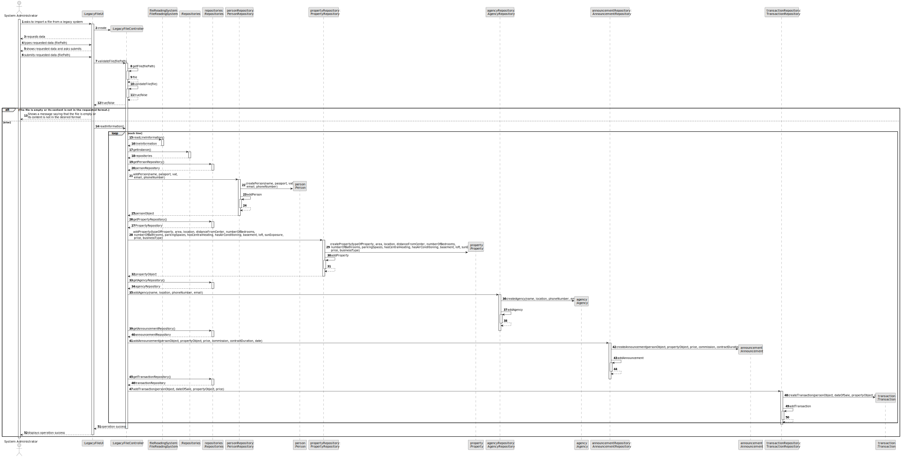
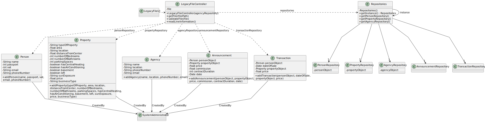

# US 012

## 3. Design - User Story Realization 

### 3.1. Rationale

**SSD - Alternative 1 is adopted.**

| Interaction ID                                           | Question: Which class is responsible for...       | Answer               | Justification (with patterns) |
|:---------------------------------------------------------|:--------------------------------------------------|:---------------------|:------------------------------|
| Step 1 : Asks to import information from a legacy system | 	... interacting with the actor?                  | LegacyFileUI         | Pure Fabrication              |
| 			  		                                                  | ... coordinating the US?                          | LegacyFileController | Controller                    |
| Step 2 : Request data  		                                | ... validating the data?							                   | LegacyFileController | Controller                    |
| Step 3 : Types requested data (filePath) 		              | ... validating the data locally (mandatory data)? | LegacyFileController | Controller                    |
| Step 4 : Shows requested data and asks submits           |                                                   |                      |                               |
| Step 5 : Submits requested data (filePath)               |                                                   |                      |                               |   
| Step 6/7 : Informs operation (in)success                 | ... informing operation success?                  | LegacyFileUI         | Pure fabrication              |

### Systematization ##

According to the taken rationale, the conceptual classes promoted to software classes are: 

 * 

Other software classes (i.e. Pure Fabrication) identified: 

 * LegacyFileUI
 * LegacyFileController

## 3.2. Sequence Diagram (SD)

### Alternative 1 - Full Diagram

This diagram shows the full sequence of interactions between the classes involved in the realization of this user story.

## 3.3. Class Diagram (CD)

