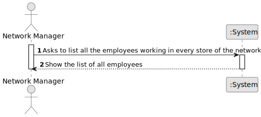

# US 013 

## 1. Requirements Engineering

### 1.1. User Story Description

As a network manager, I want to list all employees working in every store of the network.

### 1.2. Customer Specifications and Clarifications 

**From the specifications document:**

>	Each store in the network has a store manager and the set of stores is managed by a store network
manager. The main functions of a store manager are to monitor and streamline the branch with the
aim of getting to know better the business carried out and to analyse and evaluate the performance
of employees.

**From the client clarifications:**

> **Question:**  Do you want a list where the header is ID, the name of the store, and the total number of listings that the store has?
>  
> **Answer:**  Yes.

> **Question:** 
>  
> **Answer:** 

> **Question:** 
> 
> **Answer:** 

### 1.3. Acceptance Criteria

* **AC1:** The list of employees should be alphabetically sorted and grouped by store.
* **AC2:** Stores should be sorted according to their property listings, from the one with more listings to the one with less listings.
* **AC3:** Each store should state how many property listings it has

### 1.4. Found out Dependencies

* There is a dependency to "US003" since is necessary to have registered employees to list.
* There is another dependency tu "US005" since is necessary to have resistered stores.

### 1.5 Input and Output Data

**Input Data:**

* Typed data:
	* None

* Selected Data:
    * None

**Output Data:**

* Show the list of all employees working in every store

### 1.6. System Sequence Diagram (SSD)

### 1.7 Other Relevant Remarks

* 