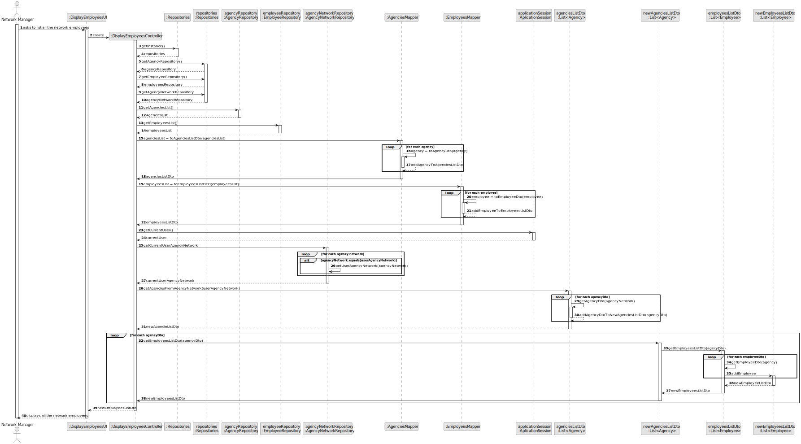
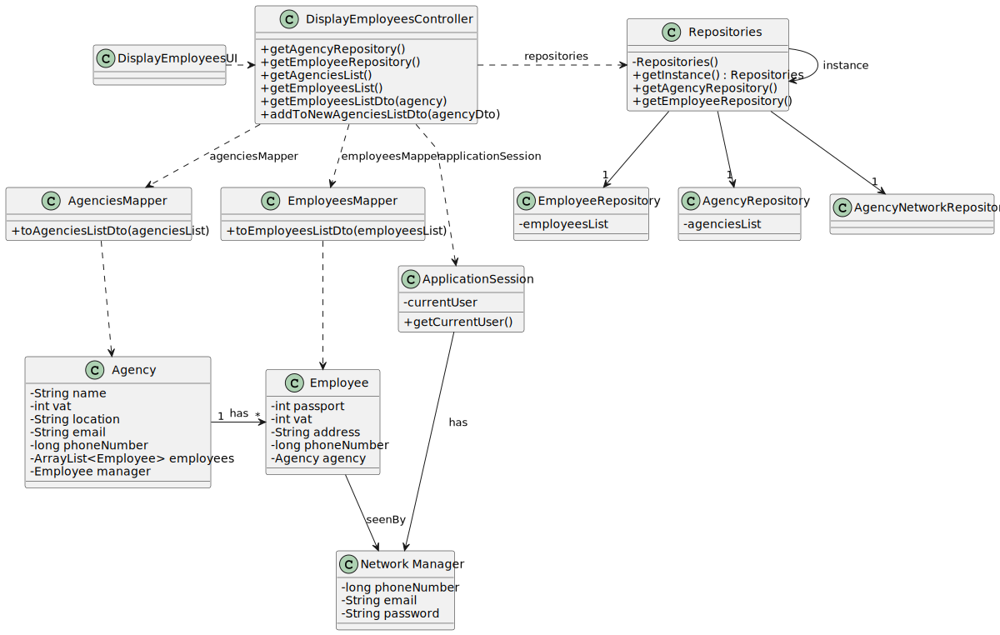

# US 013

## 3. Design - User Story Realization 

### 3.1. Rationale

**SSD - Alternative 1 is adopted.**

| Interaction ID                                                                     | Question: Which class is responsible for... | Answer                     | Justification (with patterns) |
|:-----------------------------------------------------------------------------------|:--------------------------------------------|:---------------------------|:------------------------------|
| Step 1 : Asks to list all the employees working in every store of the network   		 | 	... interacting with the actor?            | DisplayEmployeesUI         | Pure Fabrication              |
| 			  		                                                                            | 	... coordinating the US?                   | DisplayEmployeesController | Controller                    |
| Step 2 : Show the list of all employees   		                                       | 		 					                                    |                            |                               |

### Systematization ##

According to the taken rationale, the conceptual classes promoted to software classes are: 

 * Employee
 * Agency

Other software classes (i.e. Pure Fabrication) identified: 

 * DisplayEmployeesUI  
 * DisplayEmployeesController

## 3.2. Sequence Diagram (SD)

### Alternative 1 - Full Diagram

This diagram shows the full sequence of interactions between the classes involved in the realization of this user story.

## 3.3. Class Diagram (CD)

